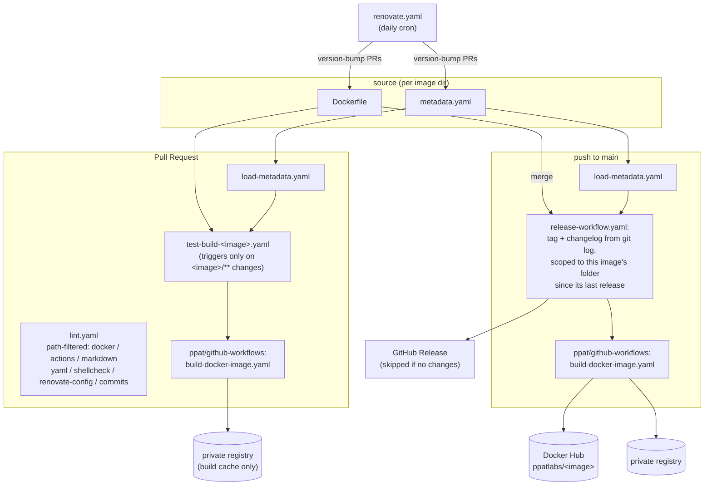

# Design

Why this repo is shaped the way it is: the decisions, the trade-offs behind them, and how the
pieces work together as one system. For the image catalog and usage, see [README.md](README.md).
For commands and repo-specific working conventions, see [CLAUDE.md](CLAUDE.md).

## Intent

This repo exists to publish a small number of Docker images to Docker Hub (`ppatlabs/<image>`)
that the author's homelab/Kubernetes cluster depends on, and to keep those images' base images,
CLI tool versions, and GitHub Actions references current with as little manual effort as
possible. The commit history bears this out: the overwhelming majority of commits are
Renovate-authored version bumps, not hand-written feature work. Every structural decision below
optimizes for that reality — a repo mostly maintained by a bot, occasionally touched by a human
adding or reworking one image.

## System view

The loop that actually drives most activity is Renovate → PR → `test-build` (lint + real
multi-arch build, no push) → merge → `publish` (tag, changelog, build, push). A human only enters
this loop to add a new image or change one image's Dockerfile/entrypoint by hand.

## Decisions and trade-offs

**One repo, one image per top-level directory, each released independently.**
Images share nothing at runtime and have almost nothing in common (a `bitwarden-cli` release has
no bearing on `freeradius-server`), so each gets its own version, its own GitHub Release tag
(`<image>/<version>-<timestamp>`), and its own changelog scoped to `git log -- <image>/` since
that image's last release. The monorepo container exists purely so the three images can share one
CI/lint/Renovate configuration instead of maintaining it three times. The cost is workflow
duplication: `publish-<image>.yaml` and `test-build-<image>.yaml` exist once per image and differ
only in `image_name` and the registry paths derived from it, because GitHub Actions `paths:`
trigger filters must be static per workflow file — they can't be computed from a matrix at trigger
time, which is what would otherwise let one parameterized workflow cover all three images.

**`metadata.yaml` as the single per-image source of truth.**
`image_version`, `label_title`, `label_description`, and `build_timeout` live in one YAML file per
image and are read at CI time by `load-metadata.yaml`, rather than being duplicated as workflow
inputs or baked into each Dockerfile. This is what lets the publish/test-build workflows stay
nearly identical across images — only the metadata content differs, not the workflow logic.

**Release only happens if there's something to release.**
`release-workflow.yaml` computes the changelog range from the last release tag matching
`<image>/*` and aborts the release (non-zero exit, no tag, no build/push) if that range produces
no commits touching the image's folder. Without this, merging a change to `tools/` would also
mint an empty, meaningless release for `bitwarden-cli` and `freeradius-server` since all three
publish workflows watch the same `main` branch.

**PR builds build for real (multi-arch, to a private cache) but never push to Docker Hub.**
The only pre-merge signal that an image is buildable is an actual `docker buildx build` across
`linux/amd64,linux/arm64`, executed via the shared `build-docker-image.yaml` reusable workflow.
There is no separate unit/integration test suite — for a Dockerfile-only repo, "it builds
correctly for both target architectures" is the meaningful test. See
[CLAUDE.md](CLAUDE.md#how-a-change-is-verified) for how to approximate this locally.

**CI logic lives in a separate `ppat/github-workflows` repo, pinned by SHA with a version-tag
comment.** Reusable steps (build-docker-image, the per-linter jobs, detect-changed-files,
update-aqua-checksums, renovate) are shared not just across this repo's three images but across
the author's other repos. The cost is an external dependency that this repo can't unilaterally
change — mitigated by pinning to a commit SHA (not just a tag) so Renovate-driven bumps to it are
auditable and reviewable like any other dependency update.

**Renovate is tuned per risk tier, not applied uniformly.** `image-updates.json` and
`aqua-cli-tools.json` both separate patch/minor/major and gate automerge behind a minimum release
age (1/7/30+ days respectively), with major bumps always requiring manual merge and a
`BREAKING CHANGE` marker. Given how much of this repo's traffic is Renovate PRs, uniform
automerge would be too risky (silently shipping a major bump) and uniform manual review would
defeat the point of automation — the tiering is the trade-off resolution.

**`tools` is a multi-stage build using `aqua` as a declarative CLI version manager, with a
builder stage that compresses binaries via `upx` before copying only the compiled binaries into
the final Alpine stage.** This keeps the runtime image to "Alpine + apk packages + a handful of
static binaries" rather than carrying aqua itself or Go/Rust toolchains into the shipped image;
the trade-off is a more complex two-stage Dockerfile and reliance on `aqua`'s checksum file
(`tools/aqua-checksums.json`, kept current by `update-aqua-checksum.yaml`) for supply-chain
integrity.

**`bitwarden-cli` and `freeradius-server` build on `debian:bookworm-slim`, not Alpine.**
`bitwarden-cli` needs glibc-linked shared libraries the upstream CLI binary was built against;
`freeradius-server` needs a wide set of optional protocol/driver libraries (LDAP, MySQL, Postgres,
Redis, unixODBC, etc.) that are far easier to satisfy from Debian's package set. Both accept the
larger base image size as the cost of avoiding a from-scratch musl/Alpine port.

**`freeradius-server` builds FreeRADIUS from source against a pinned upstream git tag rather than
re-tagging the official image.** The official `freeradius/freeradius-server` image doesn't cover
`arm64`; building from `debian/rules`/`dpkg-buildpackage` in a builder stage, keyed by
`$TARGETARCH`, is what makes the image genuinely multi-arch — the trade-off is a much longer,
much slower (`build_timeout: 180`) build compared to the other two images.

## Outcomes targeted

- Every published image is reproducible from a pinned digest/version and carries build
  provenance labels (`label_title`/`label_description` from `metadata.yaml`).
- `linux/amd64` and `linux/arm64` support for every image, verified on every PR, not just at
  release time.
- Dependency currency (base images, CLI tool pins, Actions refs) with near-zero manual toil for
  low-risk bumps, while major/breaking bumps still get a human in the loop.
- A per-image, human-readable release history despite the shared monorepo — a `freeradius-server`
  release note never mentions unrelated `tools` changes and vice versa.
